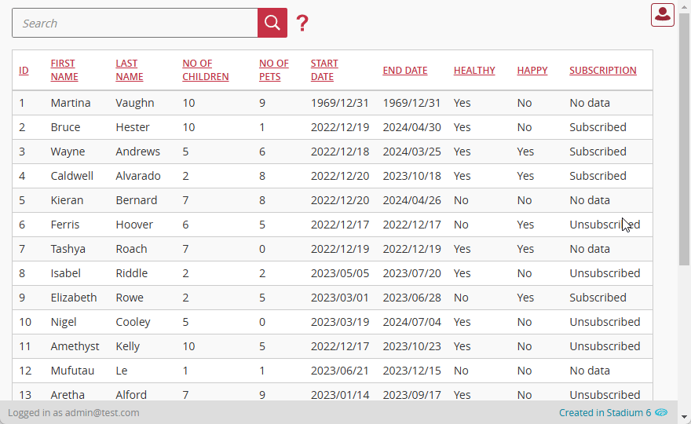

# Responsive DataGrids

Stadium's DataGrids are not responsive out-of-the-box. So, here is a method you can use to make your DataGrids display your rows as a column at a set minimum viewport width. 



## Sample applications
This repo contains one Stadium 6.7 application
[ResponsiveDGDisplay.sapz](Stadium6/ResponsiveDGDisplay.sapz?raw=true)

# Version 
1.1 Added code to detect uniqueness of DataGrid classname on page

1.1.1 Updated readme for 6.12+; Changed px to rem; Removed first column header display

## Application Setup
1. Check the *Enable Style Sheet* checkbox in the application properties

## Database, Connector and DataGrid

1. Use the instructions from [this repo](https://github.com/stadium-software/samples-database) to setup the database and DataGrid for this sample
2. Assign a class to the DataGrid, like "datagrid-responsive". This class will be used to identify the DataGrid that will become responsive. 

## Global Script

1. Create a Global Script and name it "ResponsiveDataGrid"
2. Add an Input parameter to the "ResponsiveDataGrid" script and call it "DataGridClass"
3. Drag a Javascript action into the script and paste the Javascript below into the *code* property
```javascript
/* Stadium Script Version 1.1 https://github.com/stadium-software/responsive-datagrid */
let dgClassName = "." + ~.Parameters.Input.DataGridClass;
let dg = document.querySelectorAll(dgClassName);
if (dg.length == 0) {
    dg = document.querySelector(".data-grid-container");
} else if (dg.length > 1) {
    console.error("The class '" + dgClassName + "' is assigned to multiple DataGrids. DataGrids using this script must have unique classnames");
    return false;
} else { 
    dg = dg[0];
}
let table = dg.querySelector("table");
attachResponsiveClass();

function convertRows() {
    let tblheadings = table.querySelectorAll("thead tr th");
    let tblrows = table.querySelectorAll("tbody tr");
    for (let i = 0; i < tblrows.length; i++) {
        let tblcells = tblrows[i].querySelectorAll("td");
        for (let th = 0; th < tblheadings.length; th++) {
            tblcells[th].setAttribute("name", tblheadings[th].innerText);
        }
    }
}
function attachResponsiveClass() { 
    dg.classList.add("stadium-responsive-datagrid");
}
let options = {
        characterData: true,
        attributes: false,
        childList: true,
        subtree: true,
        characterDataOldValue: true,
    },
    observer = new MutationObserver(convertRows);
observer.observe(table, options);
```

## Page.Load Event Handler

1. Drag the "ResponsiveDataGrid" global script into the event handler as the **first action** in the script (important!)
2. Enter the class you added to the DataGrid above into the *DataGridClass* input parameter (e.g. "datagrid-responsive")

## Customising the ResponsiveDataGrid
The *responsive-datagrid-variables.css* file included in this repo contains a set of variables that can be changed to customise the responsive view
1. Open the CSS file called [*responsive-datagrid-variables.css*](responsive-datagrid-variables.css) from this repo in an editor of your choice (I recommend [VS Code](https://code.visualstudio.com/))
2. Adjust the variables in the *:root* element as you see fit

## CSS
The CSS below is required for the correct functioning of the module. Variables exposed in the [*css-file-variables.css*](css-file-variables.css) file can be [customised](#customising-css).

### Before v6.12
1. Create a folder called "CSS" inside of your Embedded Files in your application
2. Drag the two CSS files from this repo [*css-file-variables.css*](css-file-variables.css) and [*css-file.css*](css-file.css) into that folder
3. Paste the link tags below into the *head* property of your application
```html
<link rel="stylesheet" href="{EmbeddedFiles}/CSS/css-file.css">
<link rel="stylesheet" href="{EmbeddedFiles}/CSS/css-file-variables.css">
``` 

### v6.12+
1. Create a folder called "CSS" inside of your Embedded Files in your application
2. Drag the CSS files from this repo [*css-file.css*](css-file.css) into that folder
3. Paste the link tag below into the *head* property of your application
```html
<link rel="stylesheet" href="{EmbeddedFiles}/CSS/css-file.css">
``` 

### Customising CSS
1. Open the CSS file called [*css-file-variables.css*](css-file-variables.css) from this repo
2. Adjust the variables in the *:root* element as you see fit
3. Stadium 6.12+ users can comment out any variable they do **not** want to customise
4. Add the [*css-file-variables.css*](css-file-variables.css) to the "CSS" folder in the EmbeddedFiles (overwrite)
5. Paste the link tag below into the *head* property of your application (if you don't already have it there)
```html
<link rel="stylesheet" href="{EmbeddedFiles}/CSS/css-file-variables.css">
``` 
6. Add the file to the "CSS" inside of your Embedded Files in your application

**NOTE: Do not change any of the CSS in the 'css-file.css' file**

## Upgrading Stadium Repos
Stadium Repos are not static. They change as additional features are added and bugs are fixed. Using the right method to work with Stadium Repos allows for upgrading them in a controlled manner. 

How to use and update application repos is described here: [Working with Stadium Repos](https://github.com/stadium-software/samples-upgrading)